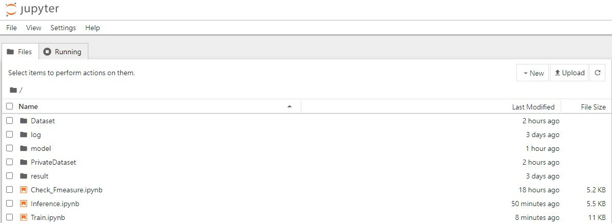
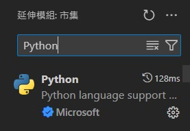
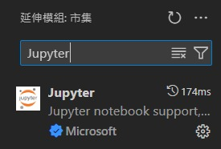
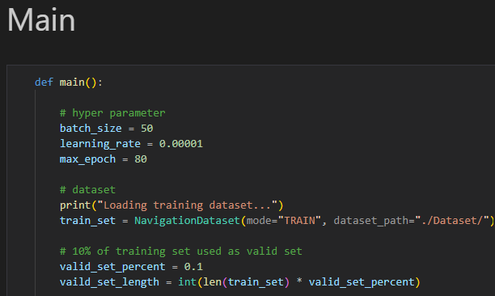
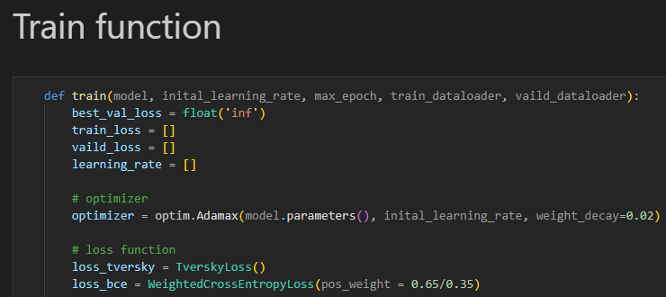
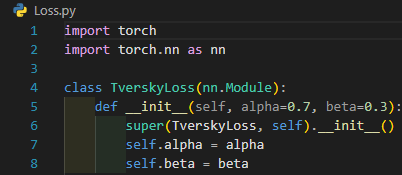
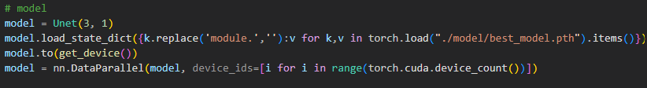

# T-Brain Machine Learning Competition建構無人機於自然環境偵察時所需之導航資訊 競賽 II － 導航資料生成競賽 TEAM_5619 source code

## File hierarchy:

|Dirctory or file|Description|
|  ----  | ----  |
|/images/|Store image for `README.md`|
|/Dataset.zip/Dataset/Training_datast/img/|Store images for training.|
|/Dataset.zip/Dataset/Training_datast/label_img/|Store ground truth images for training.|
|/Dataset.zip/Dataset/Training_datast/img/|Store images for public testing.|
|/PrivateDataset.zip/PrivateDataset/Testing_dataset/|Store images for private testing.|
|/log/|Store infomation throuth previous training.|
|/result/|Store the result of last time inference.|
|/model/|Store the models of last training. During training there are two model will be saved, call ```best_model.pth``` and ```newest_model.pth```, ```best_model.pth``` is lowest validation loss model, ```newst_model.pth``` is newst model.|
|/model/Strongest_model.pth|My best model in this competition, which got ```0.808814``` score in public testing dataset and ```0.808727``` score in private testing dataset.|
|/utils.py|Python file which store every helper function in this project.|
|/Dataset.py|Python file wihich store ```NavigationDataset``` for training and inferencing,  ```ValidationDataset``` for checking F-measure score.|
|/Loss.py|Python file which store ```TverskyLoss``` and ```WeightedCrossEntropyLoss```source code for training.|
|/Model.py|Python file which store my version of ```Unet``` class for training.|
|/Train.ipynb|Jupyter notebook source code to train model.|
|/Inference.ipynb|Jupyter notebook source code to inference model after training.|
|/Check_Fmeasure.ipynb|Jupyter notebook source code to check F-score in ```training_dataset``` after training.|

## Run:
* Make sure your environment support Python3.9.19 or above, Pytorch2.1.2 or above and Cuda 12.1 or above which can use GPU to calculate.
* Download this project to your environment.
* Create empty directories `/log/`, `/model/` and `/result/`.
* Download Dataset.zip and PrivateDataset.zip from [Dataset](https://drive.google.com/file/d/1UoapNsosdGx4X2nO9FrdaqElFoc8BnC0/view?usp=sharing) and [PrivateDataset](https://drive.google.com/file/d/1lNh7ewL8dOc_2gOlL6azcWLePfHlmxME/view?usp=sharing)
* Unzip Dataset.zip and PrivateDataset.zip to this project root.
* Download `Strongest_model.pth` from [Strongest_model.pth](https://drive.google.com/file/d/1kPrNtFWuDS1bq-hxK6VCbTn6Egh47R_F/view?usp=sharing) to `/model/`
* To open Jupyter notebook
1. Use notebook package, type 
```
pip install notebook
```
After installation ,in this project root directory terminal, type
```
jupyter notebook
```


2. Use VScode  
Install Python and Jupyter extension in your Vscode  

  
Then you can run .ipynb file in VScode

## Hypter parameter

|Name|Description|
|  ---- |---- |
|```batch_size```|`50` is maximum size for 1080 Ti * 4. If your GPU has larger cuda memory, this parameter can be larger.|
|```learning_rate```|Initial learning rate for training. This value has best performance in training I tried.|
|```max_epoch```|In my observation, after `80` epoch, loss in training dataset and validation dataset is already converged.|
|```valid_set_percent```|How many percent validation set in original training dataset. I use `0.1` in this competition.|
|```weight_decay```|Parameter to implement L2 regularization.`0.02` has best performance in training I tried. |
|```pos_weight```|Positive sample weight in weighted binary cross entropy loss, `0.65/0.35` has best performance in training I tried.|
|```alpha``` and ```beta``` in ```TverskyLoss```|I used ```alpha + beta = 1``` and ```beta = 0.3``` in this comptition.|

* ```batch_size```, ```learning_rate```, ```max_epoch``` and ```valid_set_percent```  in ```Train.ipynb```  


* ```weight_decay``` and  ```pos_weight```in ```Train.ipynb```  


* ```alpha``` and  ```beta```in ```Loss.py```  


## Useage
* Make sure there are empty directories `model`, `log` and `result`.
* Before Run any file, make sure you are already downloaded `Dataset.zip` and `PrivateDataset.zip` and Unzip it.
* Run `Train.ipynb` to train model, you can change hyper parameter.
* Run `Check_Fmeasure.ipynb` to check F-score in traininng datast.
* Run `Inference.ipynb` to inference the model you trained before.
If you want to inference different model, change file path from ```"./model/best_model.pth"``` to you like in `Inference.ipynb`. After runing `Inference.ipynb` it will create `result.zip` which content Inference result.  


## Note
Dataset in this project is downloaded from  
[以生成式AI建構無人機於自然環境偵察時所需之導航資訊競賽 II － 導航資料生成競賽](https://tbrain.trendmicro.com.tw/Competitions/Details/35)  
and be reanmed.

|Before rename|After rename|
|----|----|
|/35_Competition 2_Training dataset_V3.zip/Training_dataset/img|/Dataset/Training_datast/img/|
|/35_Competition 2_Training dataset_V3.zip/Training_dataset/label_img|/Dataset/Training_datast/label_img/|
|/35_Competition 2_public testing dataset.zip/img|/Dataset/Testing_datast/label_img/|
|/35_Competition 2_Private Test Dataset.zip/35_Competition 2_Private Test Dataset/img|/PrivateDataset/Testing_dataset/img/|
